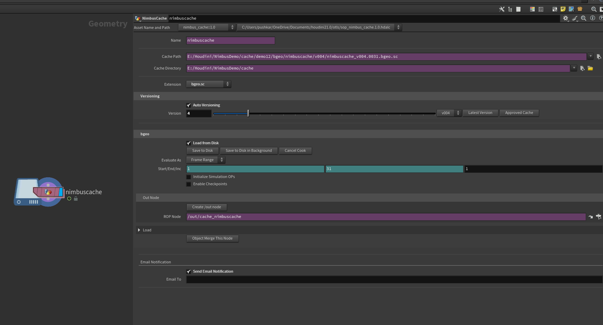

# Nimbus Cache (SOP Level) — Cache & Export Operator

*The SOP-level HDA used for export/caching and version control.*

---

## 1️⃣ Purpose

**Nimbus Cache** handles FX/geo caching at the SOP level with automatic paths, versions, and clean naming.  
It writes common formats like **.bgeo.sc**, and can hand off to an **/out** ROP for farm runs.

---

## 2️⃣ Quick Start

1. Drop **Nimbus Cache** in your SOP network after the node you want to cache.  
2. Pick **Extension** (e.g., `.bgeo.sc`) and set the **frame range**.  
3. Enable **Auto Versioning** (recommended), then **Save to Disk** (local) or create the **/out** ROP to send from OUT.

---

## 3️⃣ UI Reference

### A) Naming & Paths
| Control | What it does |
|---|---|
| **Name** | Logical cache name. Used in folder/file naming. |
| **Cache Path** | Full resolved output (read-only). Comes from the OBJ Nimbus variables (e.g. `$CACHE`). |
| **Cache Directory** | Base directory (usually `$CACHE`). You can browse to verify. |
| **Extension** | Output type: typically `.bgeo.sc` (fast & compressed). |

> **Example path**  
> `E:/Houdini/NimbusDemo/cache/demo12/bgeo/nimbuscache/v003/nimbuscache_v003.$F4.bgeo.sc`

---

### B) Versioning
| Control | What it does |
|---|---|
| **Auto Versioning** | Bumps to the next **major** version on save (e.g., `v003 → v004`). |
| **Version slider** | Manually preview/set a version. |
| **Latest Version** | Jumps to the highest existing version on disk. |
| **Approved Cache** | Optional flag to mark a version as approved ( visual cue for the team ). |

> **Naming reminder**  
> HIP naming uses **minor + major** (e.g., `_001_v014`). Cache versions typically track **major**: `v001`, `v002`, `v003…`.

---

### C) Caching (bgeo)
| Control | What it does |
|---|---|
| **Load from Disk** | Switches the node to read existing files instead of cooking upstream. |
| **Save to Disk** | Writes the cache now (foreground). |
| **Save to Disk in Background** | Spawns a background process; keeps the UI responsive. |
| **Cancel Cook** | Stops the current write. |
| **Evaluate As** | `Frame Range` (sequence) or a single frame. |
| **Start/End/Inc** | Cache range; defaults to scene range. |
| **Initialize Simulation OPs** | Forces a clean sim state before caching. |
| **Enable Checkpoints** | Writes intermittent frames for long sims (resume options depend on your setup). |

---

### D) Out Node (Farm Hand-off)
| Control | What it does |
|---|---|
| **Create /out node** | Builds a paired **ROP NimbusCache** in `/out` with this node wired in. |
| **ROP Node** | The created node’s path (e.g., `/out/cache_nimbuscache`). Submit from **/out** for HQueue/Deadline. |

---

### E) Load
| Control | What it does |
|---|---|
| **Object Merge This Node** | Creates an Object Merge pointing back to this cache output for easy reuse elsewhere. |

---

### F) Email Notification
| Control | What it does |
|---|---|
| **Send Email Notification** | Sends a simple “cache finished” email after completion. |
| **Email To** | Recipient(s) list. Useful for long sims or background writes. |

---

## 4️⃣ Output Examples

- Sequence:  

$CACHE/demo12/bgeo/nimbuscache/v003/nimbuscache_v003.$F4.bgeo.sc

Expands to:  

E:/Houdini/NimbusDemo/cache/demo12/bgeo/nimbuscache/v003/nimbuscache_v003.0031.bgeo.sc

- Switching to **Load from Disk** will read:  

.../v003/nimbuscache_v003.$F4.bgeo.sc

---

## 5️⃣ Best Practices

- Set **Project/Scene/Shot** on the **OBJ Nimbus** first — all paths resolve from there.  
- Keep **Auto Versioning** on; don’t overwrite previous caches.  
- Use **Background Save** for heavy sims while you continue look-dev.  
- Create the **/out** ROP when you’re ready to submit to farm (HQueue/Deadline).  
- Use **Load from Disk** after a successful cache to lock work and speed up the scene.

---

## 6️⃣ Troubleshooting

- **Path shows blank or wrong drive** → Check OBJ Nimbus and `$CACHE` variable.  
- **No files after save** → Confirm the frame range and that you’re not on **Load from Disk**.  
- **Farm cannot find files** → Ensure the cache directory is on a shared/network path visible to HQueue/Deadline workers.

---

**Next:** configure chained jobs and review hooks in the **ROP NimbusCache (OUT)** guide.

