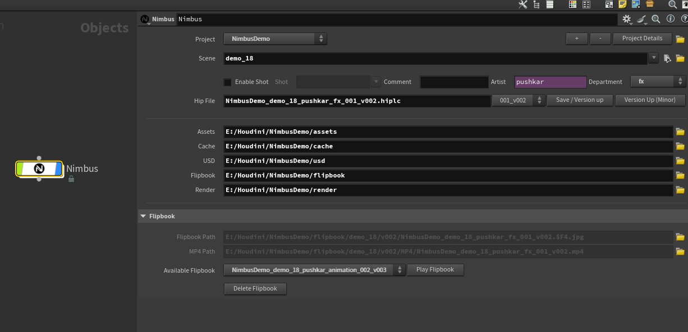

# 🌀 Nimbus (OBJ Level) — Project and Shot Manager

The **Nimbus (OBJ Level)** HDA manages your project hierarchy, scene naming, file versioning, and directory structure.  
It standardizes how HIP files are saved, ensuring consistent paths for assets, caches, flipbooks, renders, and USD exports.

---

## 🌟 Main Sections

---

### 🔹 1️⃣ Project Details

| **Parameter** | **Description** |
|----------------|-----------------|
| **Project / Scene / Shot** | Defines your project structure. The **Scene** field doesn’t strictly mean “sequence” — it can represent any logical group such as *sequence*, *element*, or *FX category* (e.g. `fire`, `destruction`, `water_interaction`).  **Example:** `Project = NimbusDemo`, `Scene = Fire`, `Shot = SH010`. |
| **Enable Shot** | Adds the shot name directly to the HIP file name instead of creating a separate shot folder. Useful when multiple shots are managed within the same project directory.  **Example Output:** `NimbusDemo_demo12_sh01_pushkar_fx_001_v001.hiplc`. |
| **Comment** | Optional note field for internal tracking or quick identification of tasks. |
| **Artist** | Automatically filled from your system’s username (e.g. Windows or macOS user account). |
| **Department** | Manually selectable (e.g. `FX`, `Lighting`, `Lookdev`). |
| **Project Details (📄)** | Opens a popup displaying the current project information: `Project Name: NimbusDemo` `Path: E:/Houdini/NimbusDemo` `FPS: 30`. |

---

### 🧩 2️⃣ File Controls

| **Control** | **Description** |
|--------------|----------------|
| **Empty hip_file** | Displays the currently active HIP file. If no file is saved, it shows an empty entry. Once a versioned file is saved, it appears in the `ver_list` dropdown for easy access. |
| **Save / Version Up** | Saves the current `.hip` file in the project’s **HIP** directory and updates its version number.  **Example:** `NimbusDemo_001_v001.hip` → where `001 = minor version` and `v001 = major version`. |
| **Version Up (Minor)** | Increments only the minor version (`001 → 002`) while keeping the major version (`v001`) the same. Useful for internal WIP saves between publishes.  **Example:** `NimbusDemo_001_v001.hip` → `NimbusDemo_002_v001.hip`. |

---

### 📂 3️⃣ Directory Paths

| **Path** | **Description** |
|-----------|----------------|
| **Assets / Cache / USD / Flipbook / Render** | Auto-generated environment paths based on your project name and scene setup. Each path follows your base directory and can be accessed using Houdini’s environment variables. |
| **Example Syntax** | `E:/Houdini/NimbusDemo/cache`  • `E:/Houdini` → Base directory where all projects are stored. • `NimbusDemo` → Project name (can be any name). • `cache` → Folder where `.bgeo`, `.vdb`, `.abc`, or `.usd` files are saved. |
| **hip/** | Stores all Houdini scene files (`.hiplc`, `.hipnc`, `.hip`). Inside **hip**, Nimbus creates a folder per scene/element name (e.g. `demo_01`, `demo_02`).  **Example:** `E:/Houdini/NimbusDemo/hip/demo_01/` |
| **Scene Folder (inside hip)** | Each scene folder contains versioned HIP files following Nimbus’ naming convention: `E:/Houdini/NimbusDemo/hip/demo_01/NimbusDemo_demo_01_sh02_pushkar_fx_001_v014.hiplc`. |
| **Folder Icon (📁)** | Opens the corresponding directory in your file browser for quick navigation. |

---

### 🧱 Folder Structure Example

E:/Houdini/NimbusDemo/
├─ assets/
├─ cache/
├─ flipbook/
├─ hip/
│ ├─ demo_01/
│ │ ├─ backup/
│ │ ├─ temp/
│ │ ├─ NimbusDemo_demo_01_sh02_pushkar_fx_001_v014.hiplc
│ │ └─ NimbusDemo_demo_01_sh02_pushkar_fx_002_v001.hiplc
│ ├─ demo_02/
│ └─ demo_03/
├─ render/
└─ usd/

---

### 🧾 File Naming Convention

| **Component** | **Meaning** |
|----------------|-------------|
| `NimbusDemo` | Project name |
| `demo_01` | Scene or element name |
| `sh02` | Shot name (if *Enable Shot* is active) |
| `pushkar` | Artist name (auto-filled) |
| `fx` | Department |
| `001` | Minor version (auto-incremented each save) |
| `v014` | Major version (incremented manually when publishing) |

---

### ✅ Summary

Nimbus (OBJ level) provides:
- Clean project and version structure.
- Automatic artist and department tagging.
- Consistent environment variable setup.
- Simplified navigation and naming automation.

This ensures every project you start in Houdini follows a consistent, scalable pipeline — ideal for both solo and team workflows.

---

