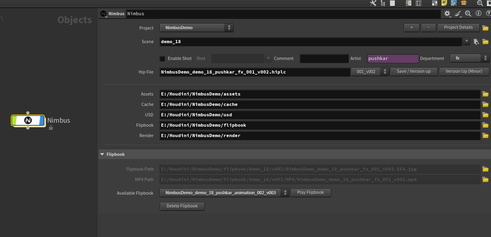

# 🌀 Nimbus (OBJ Level) — Project and Shot Manager



The **Nimbus (OBJ Level)** HDA manages your project hierarchy, scene naming, file versioning, and directory structure.  
It standardizes how HIP files are saved, ensuring consistent paths for assets, caches, flipbooks, renders, and USD exports.

---

## 🌟 Main Sections

---

### 🔹 1️⃣ Project Details

| **Parameter** | **Description** |
|----------------|-----------------|
| **Project / Scene / Shot** | Defines your project structure. The **Scene** field doesn’t strictly mean “sequence” — it can represent any logical group such as *sequence*, *element*, or *FX category* (e.g. `fire`, `destruction`, `water_interaction`).<br><br>**Example:** `Project = NimbusDemo`, `Scene = Fire`, `Shot = SH010`. |
| **Enable Shot** | Adds the shot name directly to the HIP file name instead of creating a separate shot folder. Useful when multiple shots are managed within the same project directory.<br><br>**Example Output:** `NimbusDemo_demo12_sh01_pushkar_fx_001_v001.hiplc`. |
| **Comment** | Optional note field for internal tracking or quick identification of tasks. |
| **Artist** | Automatically filled from your system’s username (e.g. Windows or macOS user account). |
| **Department** | Manually selectable (e.g. `FX`, `Lighting`, `Lookdev`). |
| **Project Details (📄)** | Opens a popup displaying the current project information:<br>`Project Name: NimbusDemo`<br>`Path: E:/Houdini/NimbusDemo`<br>`FPS: 30`. |

---

### 🧩 2️⃣ File Controls

| **Control** | **Description** |
|--------------|----------------|
| **Empty hip_file** | Displays the currently active HIP file. If no file is saved, it shows an empty entry. Once a versioned file is saved, it appears in the `ver_list` dropdown for easy access. |
| **Save / Version Up** | Saves the current `.hip` file in the project’s **HIP** directory and updates its version number.<br><br>**Example:** `NimbusDemo_001_v001.hip` → where `001 = minor version` and `v001 = major version`. |
| **Version Up (Minor)** | Increments only the minor version (`001 → 002`) while keeping the major version (`v001`) the same. Useful for internal WIP saves between publishes.<br><br>**Example:** `NimbusDemo_001_v001.hip` → `NimbusDemo_002_v001.hip`. |

---

### 📂 3️⃣ Directory Paths

| **Path** | **Description** |
|-----------|----------------|
| **Assets / Cache / USD / Flipbook / Render** | Auto-generated environment paths based on your project name and scene setup. Each path follows your base directory and can be accessed using Houdini’s environment variables. |
| **Example Syntax** | `E:/Houdini/NimbusDemo/cache`<br><br>• `E:/Houdini` → Base directory where all projects are stored.<br>• `NimbusDemo` → Project name (can be any name).<br>• `cache` → Folder where `.bgeo`, `.vdb`, `.abc`, or `.usd` files are saved. |
| **hip/** | Stores all Houdini scene files (`.hiplc`, `.hipnc`, `.hip`). Inside **hip**, Nimbus creates a folder per scene/element name (e.g. `demo_01`, `demo_02`).<br><br>**Example:** `E:/Houdini/NimbusDemo/hip/demo_01/` |
| **Scene Folder (inside hip)** | Each scene folder contains versioned HIP files following Nimbus’ naming convention:<br>`E:/Houdini/NimbusDemo/hip/demo_01/NimbusDemo_demo_01_sh02_pushkar_fx_001_v014.hiplc`. |
| **Folder Icon (📁)** | Opens the corresponding directory in your file browser for quick navigation. |

---

### 🧱 4️⃣ Folder Structure Example


```

E:/Houdini/NimbusDemo/
├─ assets/
├─ cache/
├─ flipbook/
├─ hip/
│  ├─ demo_01/
│  │  ├─ backup/
│  │  ├─ temp/
│  │  ├─ NimbusDemo_demo_01_sh02_pushkar_fx_001_v014.hiplc
│  │  └─ NimbusDemo_demo_01_sh02_pushkar_fx_002_v001.hiplc
│  ├─ demo_02/
│  └─ demo_03/
├─ render/
└─ usd/

```


---

### 🧾 5️⃣ File Naming Convention

| **Component** | **Meaning** |
|----------------|-------------|
| `NimbusDemo` | Project name |
| `demo_01` | Scene or element name |
| `sh02` | Shot name (if *Enable Shot* is active) |
| `pushkar` | Artist name (auto-filled) |
| `fx` | Department |
| `001` | Minor version (auto-incremented each save) |
| `v014` | Major version (incremented manually when publishing) |

---


### 🌐 6️⃣ Environment Variables

When a project is created using the **Nimbus Object HDA**, the following Houdini environment variables are automatically set.  
These variables dynamically adapt based on your **Project / Scene / Shot** setup and are available globally across your scene.

| Variable | Description | Example Path |
|-----------|--------------|--------------|
| **$ASSET** | Points to the **Assets** directory where geometry, textures, or reference files are stored. | `E:/Houdini/NimbusDemo/assets` |
| **$CACHE** | Points to the **Cache** directory where simulation data is saved (e.g., `.bgeo`, `.vdb`, `.abc`). Each scene creates its own subfolder for versioned caches. | `E:/Houdini/NimbusDemo/cache/demo12/bgeo/nimbuscache/v003/nimbuscache_v003.0031.bgeo.sc` |
| **$USD** | Points to the **USD** directory for storing exported USD layers and stages. | `E:/Houdini/NimbusDemo/usd` |
| **$FLIPBOOK** | Points to the **Flipbook** directory for OpenGL previews and lookdev tests. | `E:/Houdini/NimbusDemo/flipbook` |
| **$RENDER** | Points to the **Render** directory for final rendered image sequences or beauty passes. | `E:/Houdini/NimbusDemo/render` |

---

💡 **Example Usage:**

In any Houdini node (File Cache, Geometry ROP, etc.), you can use:
```bash

$CACHE/demo12/bgeo/nimbuscache/v003/nimbuscache_v003.$F4.bgeo.sc

```

### 🎬 7️⃣ Flipbook Controls

Each flipbook render and MP4 file follows the project naming convention and is saved under the `$FLIPBOOK` directory.

| Control | Description |
|----------|--------------|
| **Flipbook Path** | Displays the output path for the image sequence. Automatically versioned based on the current project, scene, and user. <br>Example: `E:/Houdini/NimbusDemo/flipbook/demo12/v023/NimbusDemo_demo12_pushkar_fx_001_v023.$F4.jpg` |
| **MP4 Path** | Shows the path for the generated MP4 file, automatically created from the image sequence after the flipbook completes. <br>Example: `E:/Houdini/NimbusDemo/flipbook/demo12/v023/MP4/NimbusDemo_demo12_pushkar_fx_001_v023.mp4` |
| **Available Flipbook** | Displays previously generated flipbooks in a dropdown list for quick access and playback. |
| **Play Flipbook** | Opens the selected flipbook MP4 or image sequence in the system’s default media player. |
| **Delete Flipbook** | Permanently removes the selected flipbook version (both image sequence and MP4) from disk. |

---

💡 **Tip:**  
All flipbook versions are stored under `$FLIPBOOK/<scene_name>/<version>/`, ensuring clean version control and easy playback access.

Example structure:
```
E:/Houdini/NimbusDemo/flipbook/demo12/
├─ v023/
│ ├─ NimbusDemo_demo12_pushkar_fx_001_v023.$F4.jpg
│ ├─ MP4/
│ │ └─ NimbusDemo_demo12_pushkar_fx_001_v023.mp4
├─ v024/
│ ├─ NimbusDemo_demo12_pushkar_fx_001_v024.$F4.jpg
│ └─ MP4/
│ └─ NimbusDemo_demo12_pushkar_fx_001_v024.mp4
```

## ✅ Summary

**Nimbus (OBJ Level HDA)** provides:

- 🧩 **Clean project, scene, and version structure** — automatically creates and organizes directories for assets, caches, renders, and USDs.  
- 👥 **Automatic artist and department tagging** — auto-fills artist name from the system user and allows department selection.  
- ⚙️ **Consistent environment variable setup** — auto-creates `$CACHE`, `$USD`, `$ASSET`, `$FLIPBOOK`, and `$RENDER` paths for global access.  
- 🗂️ **Simplified navigation and naming automation** — handles versioning, shot naming, and file paths with clean, predictable conventions.  
- 🎬 **Integrated flipbook management** — quickly render, version, and review OpenGL previews directly from the HDA.  
- 🧠 **Pipeline-ready structure** — fully compatible with HQueue, Deadline, and other Nimbus ROP tools.

---

This ensures every Houdini project you start follows a consistent, scalable, and studio-friendly pipeline —
ideal for both individual artists and small production teams.


