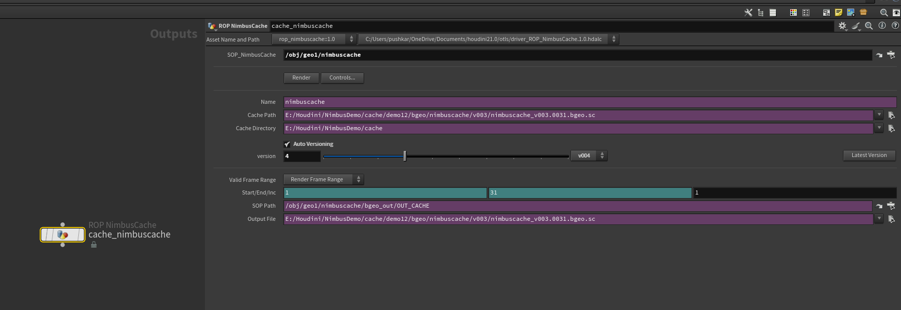

# ROP NimbusCache (OUT Level) — Simulation Export & Farm Submission


*The /out-level ROP used to drive NimbusCache jobs locally or on a render farm.*

---

## 1️⃣ Purpose

**ROP NimbusCache** is designed to automate geometry and simulation caching at the **/out** level.  
It connects directly to your **SOP NimbusCache** node, reads its versioning and paths, and executes the caching process — either locally or via HQueue/Deadline.

This ensures that all cache exports remain consistent with the version, naming, and directory structure defined in your main **OBJ Nimbus** project setup.

---

## 2️⃣ Workflow Overview

1. **Create via SOP NimbusCache:**  
   Click *“Create /out node”* in your SOP-level NimbusCache to automatically generate this ROP.

2. **Link:**  
   The field **SOP_NimbusCache** will automatically link to the correct SOP node (e.g., `/obj/geo1/nimbuscache`).

3. **Render / Controls:**  
   - **Render** executes the cache job for the defined frame range.  
   - **Controls** opens any extended task settings (like HQueue or Deadline options).

4. **Farm Ready:**  
   The ROP can be directly submitted to HQueue/Deadline for distributed caching.

---

## 3️⃣ UI Reference

### A) Link & Naming
| Parameter | Description |
|------------|-------------|
| **SOP_NimbusCache** | Linked SOP-level NimbusCache node. Defines path, extension, and version. |
| **Name** | Logical name for this cache (inherited from SOP node). |
| **Cache Path** | Read-only resolved file path for the current version. |
| **Cache Directory** | Root path of the project’s cache folder (usually `$CACHE`). |

---

### B) Versioning
| Parameter | Description |
|------------|-------------|
| **Auto Versioning** | Automatically increments the cache version (`v001 → v002 → v003`). |
| **Version Slider** | Manually review or select version number. |
| **Latest Version** | Syncs with the latest cache version from the linked SOP node. |

> 💡 **Tip:** All versioning logic stays unified — so whether you cache from SOP or /out, the version counter remains consistent.

---

### C) Frame Range
| Parameter | Description |
|------------|-------------|
| **Valid Frame Range** | Choose to render either the *Render Frame Range* or a custom range. |
| **Start / End / Inc** | Defines start, end, and increment values for caching. |
| **SOP Path** | Read-only path to the node being cached. |
| **Output File** | Full output path for the resulting cache files. |

> Example path:  
> ```
> E:/Houdini/NimbusDemo/cache/demo12/bgeo/nimbuscache/v003/nimbuscache_v003.$F4.bgeo.sc
> ```

---

### D) Farm Integration
| Parameter | Description |
|------------|-------------|
| **Render** | Runs the caching process locally. |
| **Controls** | Accesses HQueue / Deadline submission options. |
| **HQueue / Deadline Support** | The ROP is farm-ready; submit directly from here once linked to your farm manager. |

---

## 4️⃣ Automatic Linking

When created from a SOP NimbusCache node:
- The **ROP NimbusCache** automatically links back to its parent SOP.  
- It inherits:
  - Cache path and extension  
  - Frame range  
  - Version number  
  - Naming and environment variables  

If you rename the SOP node, the ROP will auto-update its internal reference path.

---

## 5️⃣ Output Example

| File Type | Path Example |
|------------|--------------|
| **Cache (.bgeo.sc)** | `E:/Houdini/NimbusDemo/cache/demo12/bgeo/nimbuscache/v003/nimbuscache_v003.0031.bgeo.sc` |
| **HIP Backup (from SOP)** | `E:/Houdini/NimbusDemo/cache/demo12/bgeo/nimbuscache/v003/NimbusDemo_demo12_pushkar_fx_001_v003.hiplc` |

---

## 6️⃣ Best Practices

- Always cache through the **ROP NimbusCache** when preparing for farm submission.  
- Maintain clean versioning by enabling **Auto Versioning** at both SOP and ROP levels.  
- Keep all paths under environment variables (`$CACHE`, `$ASSET`, `$USD`) to stay project-agnostic.  
- Test small frame ranges locally before full farm submissions.  
- Use **Render Frame Range** for production; use **Custom Range** for partial fixes.

---

## ✅ Summary

**ROP NimbusCache** acts as the execution layer for Nimbus’s caching pipeline —  
ensuring reliable, version-controlled exports both locally and on render farms.  
It inherits all settings from the SOP NimbusCache, maintaining a consistent and trackable workflow across your entire Houdini project.

---

